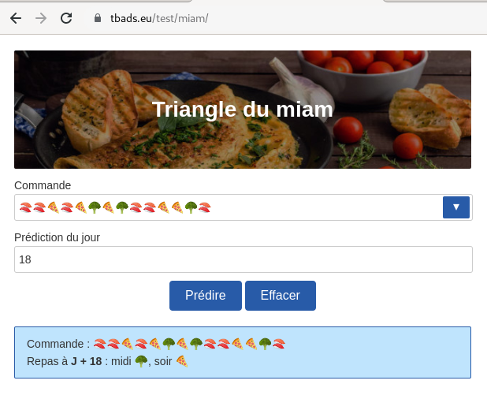

# Triangle du miam

## Introduction

Des scientifiques du CNRS viennent de trouver une loi très étrange qui permet de prédire les repas de ses étudiant•e•s plusieurs jours à l'avance et ainsi améliorer la gestion de ses stocks.

À chaque retour de vacances les étudiant•e•s font la liste des repas de la semaine en ayant le choix entre 🍣 (sushi) 🍕 (pizza) ou 🥦 (repas diététique)

Exemple de liste de la semaine (deux repas par jour pendant sept jours) :

🍣🍣🍕🍣🍕🥦🍕🥦🍣🍣🍕🍕🥦🍣 

En regardant les commandes suivantes, des scientifiques se sont rendu compte qu'ils peuvent prédire les quatre-vingts onze repas à venir et cela de manière précise grâce au **théorème du miam** 👀...

## Spécifications

- [ ] Chaque combinaison de deux repas permet de faire une prédiction comme ceci :
              
```txt
Combinaison  🍣 🍣   🍣 🍕   🍣 🥦   🍕 🥦
Prédiction    🍣      🥦      🍕     🍣
```

*Si deux repas sont similaires, la prédiction sera ce même repas. Sinon la prédiction sera le repas restant.*

- [ ] Les prédictions se font par lignes successives de taille `combinaisons précédentes - 1`, ce qui donne naissance au **Triangle du miam**.

En reprenant l'exemple précédent :

```txt
🍣 🍣 🍕 🍣 🍕 🥦 🍕 🥦 🍣 🍣 🍕 🍕 🥦 🍣
 🍣 🥦 🥦 🥦 🍣 🍣 🍣 🍕 🍣 🥦 🍕 🍣 🍕
  🍕 🥦 🥦 🍕 🍣 🍣 🥦 🥦 🍕 🍣 🥦 🥦
   🍣 🥦 🍣 🥦 🍣 🍕 🥦 🍣 🥦 🍕 🥦
    🍕 🍕 🍕 🍕 🥦 🍣 🍕 🍕 🍣 🍣
     🍕 🍕 🍕 🍣 🍕 🥦 🍕 🥦 🍣
      🍕 🍕 🥦 🥦 🍣 🍣 🍣 🍕
       🍕 🍣 🥦 🍕 🍣 🍣 🥦
        🥦 🍕 🍣 🥦 🍣 🍕
         🍣 🥦 🍕 🍕 🥦
          🍕 🍣 🍕 🍣
           🥦 🥦 🥦
            🥦 🥦
             🥦
```

- [ ] Je suis donc en mesure de connaître les repas d'un étudiant à J+18 par exemple, en calculant les jours comme ceci (midi et soir):

```txt
🍣 1 | 🍣 1 | 🍕 2 | 🍣 2 | 🍕 3 | 🥦 3 | 🍕 4 | 🥦 4 | 🍣 5 | 🍣 5 | 🍕 6 | 🍕 6 | 🥦 7 | 🍣 7
 🍣 8 | 🥦 8 | 🥦 9 | 🥦 9 | 🍣 10| 🍣 10| 🍣 11| 🍕 11| 🍣 12| 🥦 12| 🍕 13| 🍣 13| 🍕 14
  🍕 14| 🥦 15| 🥦 15| 🍕 16| 🍣 16| 🍣 17| 🥦 17| 🥦 18| 🍕 18| 🍣 ..| 🥦 ..| 🥦 ..
```

À J+18, cet étudiant mangera 🥦 le midi et 🍕 le soir !

### Solution

Une petite application web standalone (sans *back-end*) dont les choix techniques et le code seront ouverts à la discussion...



### Démonstration

Le code peut être récupéré et l'application lancée en ouvrant un navigateur web sur le fichier `index.html`
L'application est également [disponible en ligne](https://tbads.eu/test/miam/).